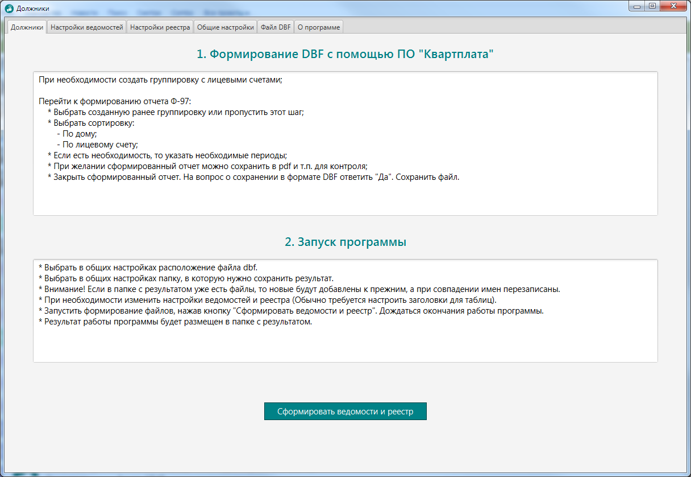
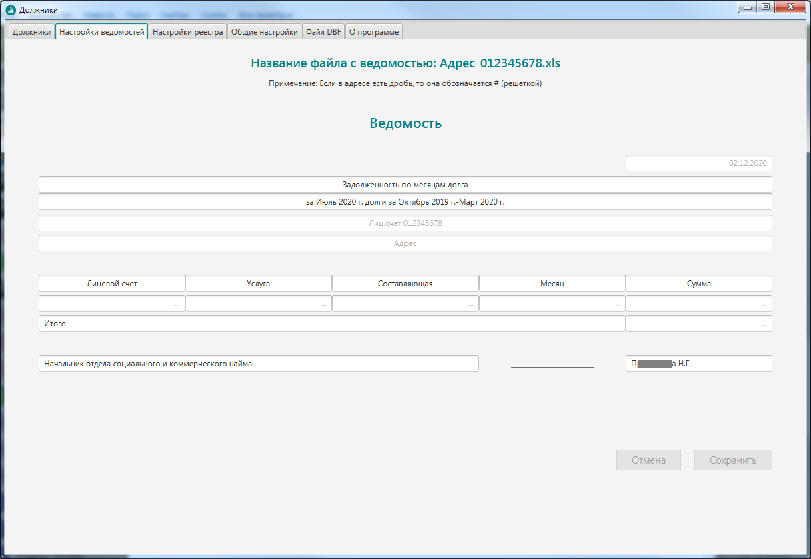
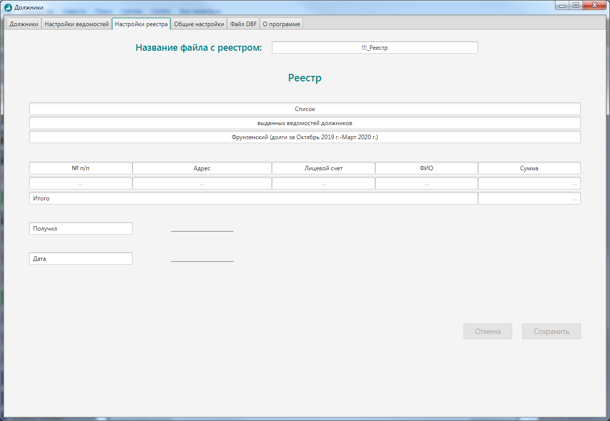
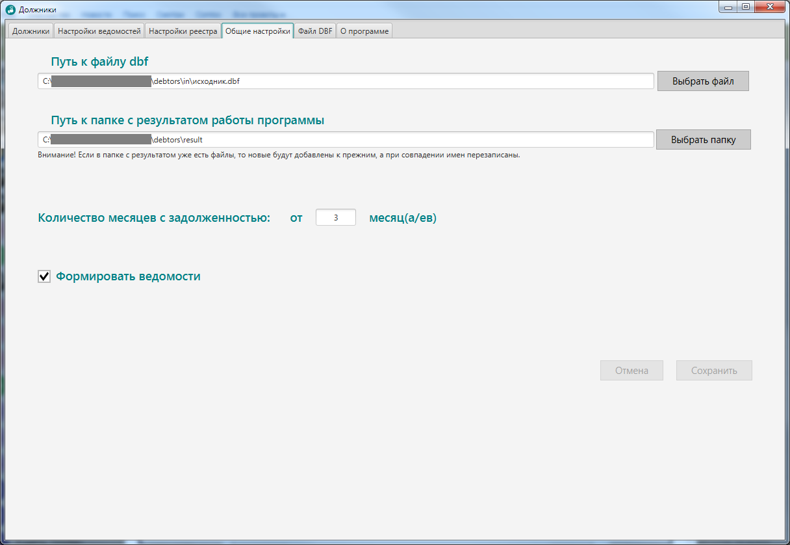
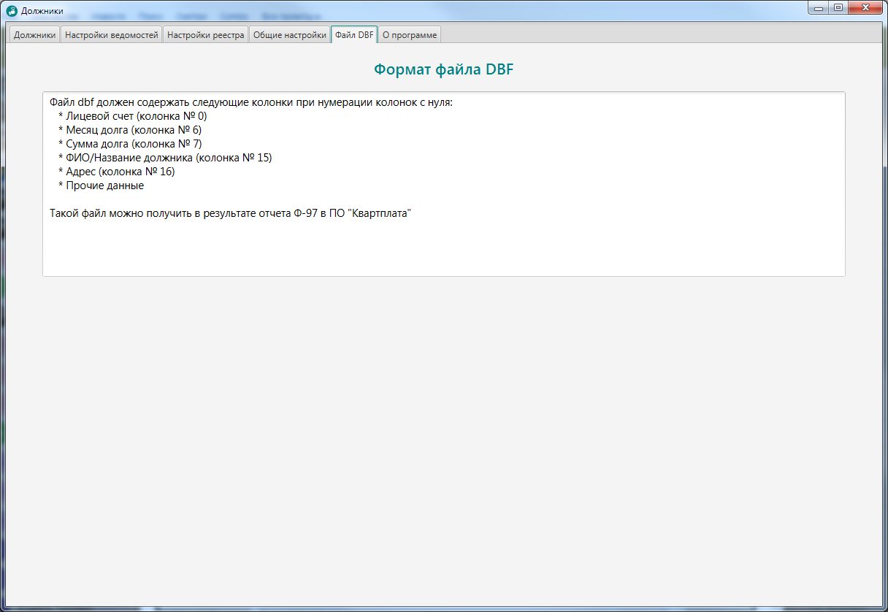
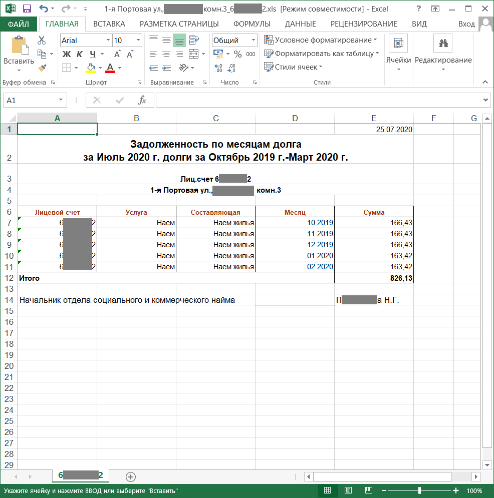
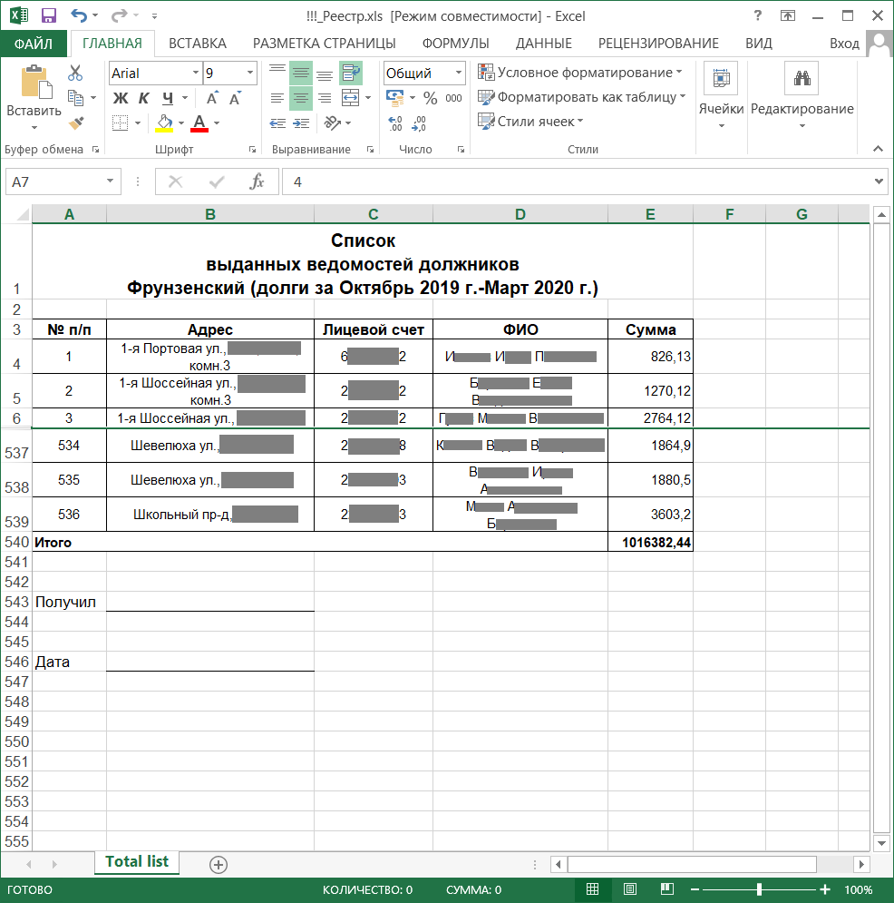

# Формирование ведомостей должников и реестра по сформированным ведомостям на основе информации из DBF файла

---

Номер регистрации (свидетельства): [2020663627](https://www1.fips.ru/registers-doc-view/fips_servlet?DB=EVM&rn=5985&DocNumber=2020663627&TypeFile=html)

---

### Название программы для ЭВМ:
Формирование ведомостей

### Реферат:
Формирование ведомостей - графическое приложение для IBM РС-совместимого компьютера, реализующее формирование реестра и ведомостей на основе информации полученной из dbf файла. Программа считывает информацию из dbf файла. Формирует на ее основе ведомости в формате xls, а также итоговый реестр в формате xls. Применяет необходимые шрифты и стили к ячейкам полученных файлов. Сохраняет файлы в папку с результатом. В параметрах программы можно задать название для реестра, необходимость формирования ведомостей, названия для полей файлов xls, расположение папки с dbf файлом, расположение папки с результатом работы программы. Тип ЭВМ: IBM PC-совместимый компьютер; ОС: Linux; Windows 7 и выше.

### Язык программирования: 
Java

### Объем программы для ЭВМ: 
27,8 МБ

---
# Программа 

Программа под ОС Windows находится в папке [program_for_windows](program_for_windows).

На компьютере должны быть установлены Oracle JRE 1.8.0_161, Oracle JDK 1.8.0_161

---

# Интерфейс программы

Инструкция.

    

Настройка ведомостей.

    

Настройка реестра.

    

Прочие настройки. Пути к файлам, нужно ли формировать ведомости или только реестр.

    

Требования к исходному файлу.

    

# Результат работы программы

Пример сформированной ведомости.

    

Пример сформированного реестра. 

*Примечание: часть строк скрыта.*

    

